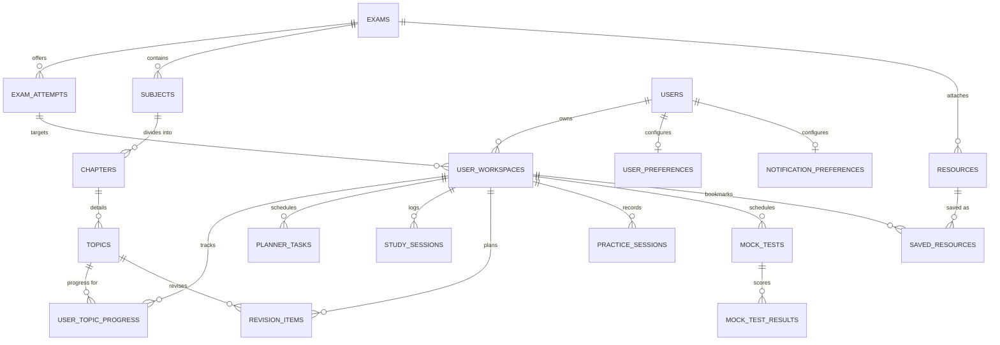

# ParikshaVerse — Database Architecture (Phase 2)

This document formalizes the ParikshaVerse domain database schema, relational structure, indexing, foreign keys, and configuration models implemented with Cloudflare D1 and Drizzle ORM.

---

## 1. Domain Overview & Entity Model

The ParikshaVerse database is partitioned into five distinct domain clusters comprising **18 tables** (plus the Phase 1 verification table `health_check`):



### Table Catalog

| Table | Domain | Primary Key | Description |
| :--- | :--- | :--- | :--- |
| `exams` | Global Content | `id` (text) | Canonical competitive exam definition (e.g. NEET, JEE). |
| `exam_attempts` | Global Content | `id` (text) | Specific target exam cycle (e.g. NEET 2027) with typed scoring configuration. |
| `subjects` | Global Content | `id` (text) | High-level subjects (e.g. Physics, Chemistry, Biology). |
| `chapters` | Global Content | `id` (text) | Units / Chapters within a subject. |
| `topics` | Global Content | `id` (text) | Granular syllabus study topics. |
| `users` | User Domain | `id` (text) | Minimal user record decoupled from auth providers. |
| `user_workspaces` | User Domain | `id` (text) | Active or historical target workspace linking a user to an exam attempt. |
| `user_topic_progress` | Progress | `id` (text) | Granular study status, attempt counts, and basis-points accuracy per topic. |
| `planner_tasks` | Planning | `id` (text) | Scheduled study, practice, revision, or mock test tasks. |
| `study_sessions` | Planning | `id` (text) | Focus session records logging actual study time. |
| `revision_items` | Planning | `id` (text) | Scheduled spaced-repetition / revision queue items. |
| `practice_sessions` | Practice | `id` (text) | Question practice session performance logs. |
| `resources` | Resources | `id` (text) | Curated study materials, NCERT links, formula sheets, notes. |
| `saved_resources` | Resources | `id` (text) | Bookmark join table between user workspaces and resources. |
| `mock_tests` | Mock Tests | `id` (text) | Full-syllabus, subject, or chapter mock test events. |
| `mock_test_results` | Mock Tests | `id` (text) | Test performance breakdown (score, correct, incorrect, accuracy). |
| `user_preferences` | Preferences | `user_id` (text) | Theme, daily study targets, and timezone. |
| `notification_preferences` | Preferences | `user_id` (text) | Granular reminder toggles. |
| `health_check` | Infrastructure | `id` (text) | Phase 1 connection and migration probe table. |

---

## 2. ID Strategy

- **User-Generated & Mutable Records**: Use stable string UUIDs (`crypto.randomUUID()`).
- **Global Exam Content**: Use deterministic, slug-prefixed stable string IDs:
  - Exam: `${slug}` or `exam_${slug}` (e.g., `exam_neet`)
  - Attempt: `attempt_${exam.slug}_${cycle}` (e.g., `attempt_neet_2027`)
  - Subject: `${exam.id}_${subject.slug}` (e.g., `exam_neet_physics`)
  - Chapter: `${subject.id}_${chapter.slug}` (e.g., `exam_neet_biology_human-reproduction`)
  - Topic: `${chapter.id}_${topic.slug}` (e.g., `exam_neet_biology_human-reproduction_menstrual-cycle`)
- **Foreign Keys**: All foreign key references use matching text IDs. Auto-increment integer identifiers are strictly avoided to eliminate synchronization collisions across edge nodes.

---

## 3. Timestamps & Timezones

- **Storage Representation**: Timestamps are stored as Unix millisecond integers using Drizzle's `{ mode: "timestamp" }` mapping.
- **Timezone Rule**: All stored timestamps are **UTC**.
- **Display Layer**: Timezone conversions (defaulting to `Asia/Kolkata` as stored in `user_preferences.timezone`) are performed strictly at the application presentation layer.
- **Standard Columns**: Every mutable record contains `created_at` and `updated_at`.

---

## 4. Status Models & Enums

### Topic Progress (`user_topic_progress.status`)
1. `not_started`: Initial unstudied state.
2. `learning`: Currently reviewing foundational material.
3. `learned`: Theory covered.
4. `practiced`: Problem-solving or questions attempted.
5. `revised`: Topic has undergone at least one revision cycle.
6. `mastered`: High accuracy and repeated successful reviews.

> [!NOTE]
> `"weak"` is **not** a mutually exclusive status. A topic can be `practiced` or `mastered` while also being flagged as weak based on performance metrics (e.g. accuracy below 70%). Weakness is dynamically derived.

### Accuracy Convention
- **Basis Points (bps)**: Stored as an integer from `0` to `10000` (where `10000 = 100.00%` and `1 bps = 0.01%`).
- **Example**: An accuracy of 85.5% is stored as `8550`. This prevents floating-point precision drift across edge SQLite nodes and ensures deterministic arithmetic.

### Other Domain Enums
- **Exam Status**: `active`, `draft`, `archived`
- **Attempt Status**: `upcoming`, `active`, `completed`, `archived`
- **Planner Task Type**: `study`, `practice`, `revision`, `mock_test`, `custom`
- **Planner Task Status**: `upcoming`, `in_progress`, `completed`, `skipped`
- **Revision Status**: `scheduled`, `completed`, `skipped`
- **Resource Type**: `ncert`, `textbook`, `notes`, `pyq`, `formula_sheet`, `revision`, `reference`
- **Mock Test Type**: `full_syllabus`, `subject`, `chapter`, `custom`
- **Theme**: `light`, `dark`, `system`

---

## 5. Foreign Key & Cascading Behaviors

- **Hierarchical Content Deletion**:
  - `exams` -> `exam_attempts`, `subjects`, `resources`: `ON DELETE CASCADE`
  - `subjects` -> `chapters`: `ON DELETE CASCADE`
  - `chapters` -> `topics`: `ON DELETE CASCADE`
- **User Workspaces**:
  - `users` -> `user_workspaces`: `ON DELETE CASCADE`
  - `user_workspaces` -> `exam_attempts`: `ON DELETE RESTRICT` (prevents deleting an exam attempt if users have active study workspaces linked to it).
- **Workspace Children**:
  - `user_workspaces` -> `user_topic_progress`, `planner_tasks`, `study_sessions`, `revision_items`, `practice_sessions`, `saved_resources`, `mock_tests`: `ON DELETE CASCADE`
- **Soft Deletion**: Not applied arbitrarily. Entities with full audit or undo requirements can add soft-delete columns in future phases when product workflows demand it.

---

## 6. Indexes & Unique Constraints

### Unique Constraints
- `exams(slug)`
- `exam_attempts(exam_id, slug)`
- `subjects(exam_id, slug)`
- `chapters(subject_id, slug)`
- `topics(chapter_id, slug)`
- `users(email)`
- `user_topic_progress(workspace_id, topic_id)`
- `saved_resources(workspace_id, resource_id)`

### Query Indexes
- `exam_attempts(exam_id)`
- `subjects(exam_id)`
- `chapters(subject_id)`
- `topics(chapter_id)`
- `user_workspaces(user_id)`, `user_workspaces(exam_attempt_id)`
- `user_topic_progress(workspace_id)`, `user_topic_progress(topic_id)`
- `planner_tasks(workspace_id, scheduled_date)`
- `study_sessions(workspace_id)`
- `revision_items(workspace_id, next_revision_at)`
- `practice_sessions(workspace_id, completed_at)`
- `resources(exam_id)`, `resources(topic_id)`
- `saved_resources(workspace_id)`
- `mock_tests(workspace_id, scheduled_at)`
- `mock_test_results(mock_test_id)`

---

## 7. Typed Exam Scoring Model

Scoring rules and exam configurations are **not** hardcoded into the relational schema. Each exam attempt stores a JSON-backed, type-safe `ExamScoringConfig` (`src/types/exam-config.ts`):

```typescript
export interface ScoringRule {
  correctMarks: number;
  incorrectMarks: number;
  unattemptedMarks: number;
}

export interface ExamScoringConfig {
  totalMarks: number;
  defaultRule: ScoringRule;
  durationMinutes: number;
  totalQuestions: number;
  sections?: ExamSectionConfig[];
  negativeMarking: boolean;
  syllabusVersion?: string;
  passingCriteriaDescription?: string;
}
```

This permits NEET (+4 / -1 / 720 marks), JEE Main (+4 / -1 / 300 marks), UPSC CSE (+2 / -0.66 / 200 marks), and other competitive exams to use the identical schema.

---

## 8. Guest vs. Authenticated Storage Boundary

- **Guest State**: Maintained on the client via the Phase 1 `StorageAdapter` (`BrowserStorageAdapter` / `MemoryStorageAdapter`).
- **Edge Cloud Database**: Cloudflare D1 with Drizzle ORM.
- **Migration Path (Phase 4+)**: When a guest creates an account or signs in, the client workspace and progress state will map 1:1 into `user_workspaces` and `user_topic_progress`.

---

## 9. Seed Strategy

- **Deterministic & Idempotent**: Seeding is executed via `pnpm db:seed` (`src/db/seeds/run.ts`) or in test suites via `seedExam(...)`.
- **Conflict Handling**: All inserts use SQLite `ON CONFLICT (...) DO UPDATE` or `ON CONFLICT DO NOTHING`.
- **Pure Canonical Hierarchy**: The production seed contains only official exam structure (exams, attempts, subjects, chapters, topics). It contains **zero** fake users, progress, tasks, or mock test results.
